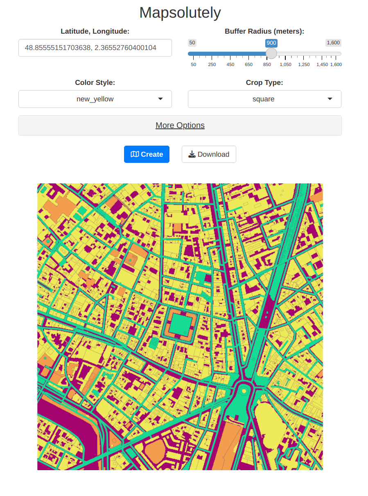

# Mapsolutely: D

Mapsolutely is an interactive Shiny application that allows users to dynamically generate customized maps using OpenStreetMap (OSM) data. With multiple predefined styles, flexible customization options, and interactive features.

  

## Features

- **Predefined Styles**: Choose from a variety of predefined styles like `buildings_rojo`, `girly`, or `new_yellow` to quickly style maps.
- **Customizable Colors**: Modify colors for specific map features (e.g., buildings, waterways, highways) and other map elements using JSON inputs.
- **Highlighting Features**: Highlight specific OpenStreetMap features using their unique IDs.
- **Dynamic Map Creation**: Generate maps for any location by specifying latitude, longitude, and buffer radius.
- **Crop and Layout Options**: Choose between square or vertical cropping, adjust margins, and set DPI for high-quality exports.
- **Interactive Inputs**: User-friendly inputs for fine-tuning map settings, including titles, subcategories, and outer margins.
- **Download Maps**: Export generated maps as high-resolution PNG files.

## Installation

1. Clone this repository:
   ```bash
   git clone https://github.com/your-username/mapsolutely.git
   ```
2. Install required R packages:
   ```R
   install.packages(c("shiny", "tmap", "osmdata", "sf", "dplyr", "shinyWidgets", "shinyjs"))
   ```
3. Run the app:
   ```R
   shiny::runApp()
   ```

## Contributing

Contributions are welcome! Please fork this repository, make your changes, and submit a pull request.

## License

This project is licensed under the [MIT License](LICENSE).

## Acknowledgments

- Powered by OpenStreetMap data.
- Special thanks to the creators of `tmap` and `osmdata` for their invaluable contributions to geospatial visualization in R.
